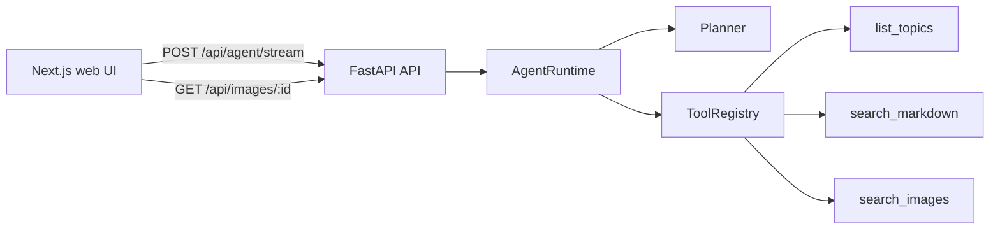

# AeroAgent MVP

AeroAgent is a bare-bones proof of concept for a notebook-connected aviation agent. This first version proves the agent shell: typed streaming responses, multimodal image cards, a center source viewer, and a read-only plug-and-play tool registry backed by filesystem notebook data.

## Architecture



## How To Run

Create or update `.env`:

```bash
OPENAI_API_KEY=your_api_key_here
OPENAI_MODEL=gpt-5.5
OPENAI_BASE_URL=
AEROAGENT_NOTEBOOK_ROOT=
NEXT_PUBLIC_API_BASE_URL=http://localhost:8000
```

```bash
docker compose up --build
```

Open `http://localhost:3000`.

The API runs on `http://localhost:8000`.

## Test Curl Command

```bash
curl -N -X POST http://localhost:8000/api/agent/stream \
  -H "Content-Type: application/json" \
  -d "{\"message\":\"show me apu images\",\"sessionId\":\"demo\"}"
```

## What Is Included

- FastAPI endpoints for health, typed agent streaming, images, and thumbnails.
- Custom Python `AgentRuntime`, `Planner`, and read-only `ToolRegistry`.
- File-backed tools: `list_topics`, `search_markdown`, and `search_images`.
- OpenAI Responses API model integration configured through `.env`.
- Next.js three-pane UI with topic placeholder, source viewer, streaming chat, and image cards.
- Docker Compose services for `api` on port `8000` and `web` on port `3000`.

## What Is Intentionally Excluded

- Real auth, database, vector DB, object storage, OCR, indexing, or LLM provider.
- Agent file writes, uploads, terminal commands, or indexing actions.
- Binary image assets; the included sample notebook uses SVG source files.

## Local Checks

```bash
python -m pytest apps/api/tests/test_agent_runtime.py -q
cd apps/web && npm test && npm run build
```

## Next Step

Point `AEROAGENT_NOTEBOOK_ROOT` at a maintained notebook corpus and expand the read-only adapter for richer metadata.
